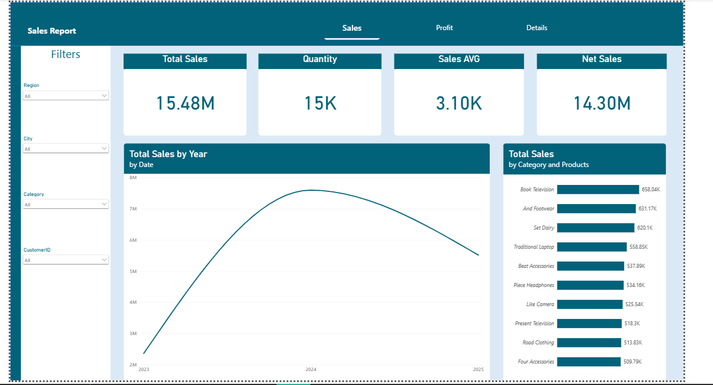
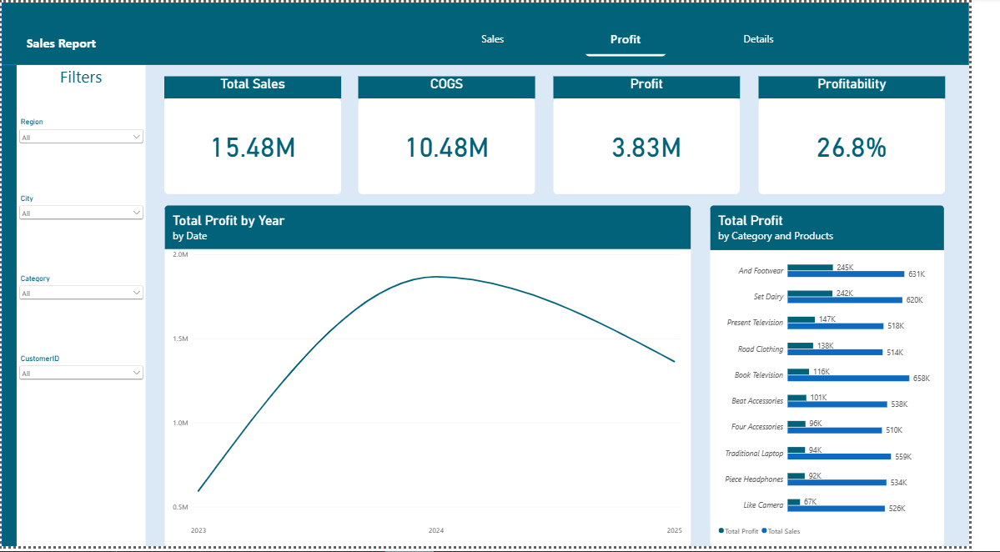
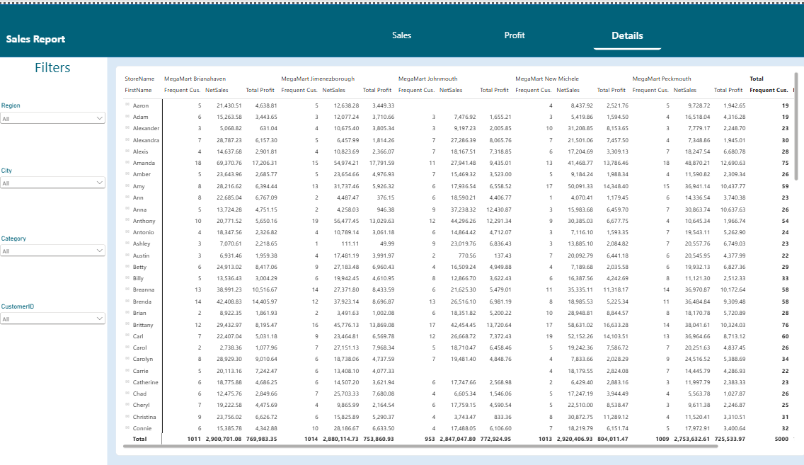

# Retail Sales Analysis Dashboard

An analysis of retail sales data with customer demographics, using Excel for data cleaning and Power BI for building an interactive dashboard.

## Project Overview

This project covers a full data analysis workflow:
1. **Data Cleaning** using Excel (Power Query)
2. **Interactive Dashboard** using Power BI

## Tools Used

- **Excel (Power Query)** - Data cleaning and transformation
- **Power BI Desktop** - Dashboard building and DAX calculations

## Workflow

### 1. Data Cleaning (Power Query)
- Converted date columns from Whole Number to proper Date data type
- Fixed customer gender values using a Conditional Column
- Applied "Use First Row as Headers" to correct column names

### 2. Dashboard (Power BI)
Built 3 interactive dashboards covering different aspects of the data, including sales performance, customer demographics, and key business metrics.

## Files in this Repository

| File | Description |
|---|---|
| `retail_sales_dataset.xlsx` | Raw data before cleaning |
| `retail_sales_cleaned.xlsx` | Cleaned data after Power Query transformations |
| `retail_sales.pbix` | Full Power BI dashboard file |
| `dashboard1_preview.png` | Preview of Dashboard 1 |
| `dashboard2_preview.png` | Preview of Dashboard 2 |
| `dashboard3_preview.png` | Preview of Dashboard 3 |

## Dashboard Previews

### Sales Dashboard

### Profit Dashboard

### Details Dashboard

**Note on Details Dashboard**: This dashboard uses a Matrix table showing customer first name, last name, store name, Frequent Customers, Net Sales, and Total Profit — allowing a detailed breakdown of performance per individual customer and store.

## Power BI Measures

- **Total Sales**: Sum of all sales transactions
- **Total Sales AVG**: Average sales value
- **Total Profit**: Sum of profit across all transactions
- **Profit AVG**: Average profit value
- **Net Sales**: Calculated as Price × Quantity × Discount
- **COGS**: Cost of Goods Sold
- **Profitability**: Total Profit divided by Net Sales (profit margin)
- **AOV (Average Order Value)**: Average amount spent per order
- **% of Total Sales**: Each item's contribution as a percentage of total sales
- **Customer Rank (CUS.Rank)**: Ranks customers based on their total sales
- **Product Rank (Prod.Rank)**: Ranks products based on total sales
- **Store Rank**: Ranks stores based on total sales
- **Frequent Customers**: Counts how many times each customer made a purchase
- **Best Payment Method**: Counts occurrences of each payment method to identify the most used one
